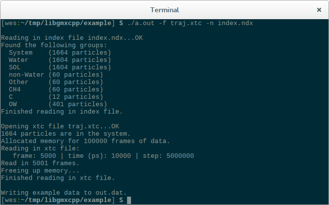

#libgmxcpp

This is a small library used for reading in Gromacs files (.xtc and .ndx) for
use in analyzing the results. This basically interfaces with the xdrfile and implements an object-oriented style.


##Requirements

The libxdrfile (ftp://ftp.gromacs.org/pub/contrib/xdrfile-1.1.1.tar.gz) library is required. It will need to be 
enabled as a shared library when you configure it for installation.

##Installation

To install do:

```bash
wget -O - https://github.com/wesbarnett/libgmxcpp/archive/v1.0.4.tar.gz | tar xvz
cd libgmxcpp-1.0.3
./configure
make
make install
```

You may have to run "make install" as root, since by default it will install to
"/usr/local/".

##Example Program

Check out the example program in the example directory. To compile it do the
following in the example directory:

```bash
g++ example.cpp -lgmxcpp
```

Then you can run the program on an example xtc file and ndx file. Run the
program and it will give you it's usage.

##Usage

See the example file as well as the comments in the source. 

The main idea is that you create a Trajectory object which contains all the
information from both the .xtc file (and optionally .ndx file). Trajectory
object methods are then used for analyzing the data.

###Construction

First, you should create a Trajectory object:

```c++
// Creates a Trajectory object with "traj.xtc" and "index.ndx"
// The index file is optional
// Both arguments are C++ strings
Trajectory traj("traj.xtc","index.ndx");
```

You could also make it a pointer:

```c++
Trajectory *traj = new Trajectory("traj.xtc","index.ndx");
```

In that case just remember to use "->" instead of "." when calling its methods.

Upon construction of a Trajectory object both the xtc file and the index file
are read into memory. The following sections detail how to access the data.

Additionally, one thing to consider is that the object initially allocates
enough memory for 100,000 frames and then reduces that to the correct amount of
frames read in. If you have more frames than that to read in, or you memory is
precious and you want to initially allocate for less, you can pass the number of
initial frames as a parameter in the construction:

```c++
// 2 million frames! With an index file.
Trajectory traj("traj.xtc","index.ndx",2000000);

// Without an index file
Trajectory traj("traj.xtc",2000000);
```

###Atomic Coordinates

To get the coordinates of an atom use GetXYZ() method:

```c++
rvec a; // rvec comes from xdrfile library and is a three dimensional float array
// Gets the 2nd atom of the 3rd frame of index group "C"
// Arguments are frame, group name, atom number, rvec variable with coordinates stored
traj.GetXYZ(2,"C",1,a);

// You can reverse the first two arguments:
traj.GetXYZ("C",2,1,a);

// You can omit the group, getting the 2nd atom in the entire system
traj.GetXYZ(2,1,a);
```

To print out the coordinates you would then do:

```c++
// X, Y, and Z are constants in Utils.h, equiv. to 0, 1, and 2
// << has been overloaded so this prints X, Y, Z coordinates with a space in
// between each, and a carriage return at the end.
cout << a;
// same as:
cout << a[X] << " " << a[Y] << " " << a[Z] << endl;
```

You can also get the coordinates of all atoms in the system or group from a
frame in an
array:

```c++
// Gets coordinates from all atoms in the system for frame 0
rvec a[traj.GetNAtoms()];
traj.GetXYZ(0,a);

// Gets coordinates from all atoms in group C for frame 0
rvec a[traj.GetNAtoms("C")];
traj.GetXYZ(0,"C",a);

// Printing the first atom from the above:
cout << a[0];

// Which is the same as:
cout << a[0][X] << " " << a[0][Y] << " " << a[0][Z] << endl;
```

Usually you'll throw GetXYZ in a couple of loops to access the data you need.

###Box Dimensions

To get the box dimensions use GetBox() method:

```c++
matrix box; // matrix is a three by three float array from xdrfile library
// Gets the box dimensions from the first frame:
traj.GetBox(0,box);

// << overloaded to print the box as a 3 x 3 matrix:
cout << box;

```
###Box Volume

To get the volume of the simulation box for any frame:

```c++
// For frame 0
double vol = traj.GetBoxVolume(0);
```

###Number of Frames

To get the number of frames in the simulation use GetNFrames():

```c++
int nframes = traj.GetNFrames();
```

###Number of Atoms
To get the number of atoms in the entire system use GetNAtoms():

```c++
int natoms = traj.GetNAtoms();
```

To get the size (number of atoms in) a specific group pass the index name as an
argument:

```c++
// Gets the number of atoms in group "SOL"
int solsize = traj.GetNAtoms("SOL"):
```


###Time and Step
To get the time (in ps) corresponding with a frame use GetTime(*frame*):

```c++
// Gets the time of the 5th frame
float time = traj.GetTime(4);
```

To get the step for a frame use GetStep(*frame*):

```c++
// Gets the step corresponding with the 5th frame
int step = traj.GetStep(4);
```

##Development

The master branch is used for development, so if you clone it and compile it, it
will be different than the latest release. It is recommended you stick to the
most recent release unless you want to test something, or you want to help with
development.

To compile the master branch do:

```bash
git clone https://github.com/wesbarnett/libgmxcpp
cd libgmxcpp

# The following are necessary only once
aclocal
automake
autoreconf -i
automake
autoconf

./configure
make
make install
```
